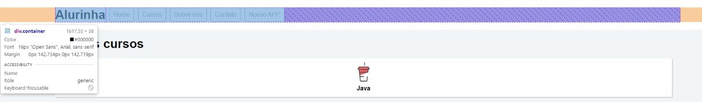
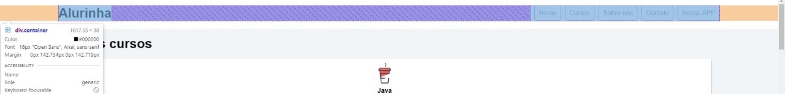
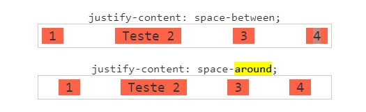
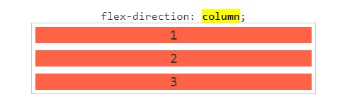
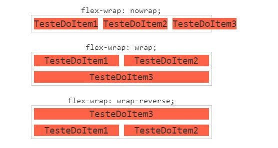

# Flexbox

Informações com referências de cursos da [Alura](https://cursos.alura.com.br), site da [MDN](https://developer.mozilla.org/) e de um projeto feito na [ORIGAMID](https://origamid.com/projetos/flexbox-guia-completo/), o qual não sou autor. As refências do mesmo e outras informações podem ser encontradas no rodapé próprio site.

# Como usar o Flexbox

## 1° - Pergunte às tags, ou classes...

Pergunte para as tags, ou classes, quem é o pai. A tag/classe pai deverá receber no CSS o seguinte parâmetro:

```css
classe-pai {
  display: flex;
}
```

> Obs.: Classes filhos ficarão com tamanhos iguais caso o pai receba display flex.

## 2° - Alinhar itens ao centro da classe pai...

Para esta ação, devemos apenas adicionar o seguinte parâmetro a classe pai:

```css
classe-pai {
    ...
  align-items: center;
}
```

## 3° - Distribuir espaço igual entre os elementos...

Nesse caso, precisamos ter um espaço em restante no espaço pai.
Por exemplo:



Utilizaremos o parâmetro:

```css
classe-pai {
    ...
  justify-content: space-between;
}
```

O resultado será:



## 4° - Distribuir espaço equivalente entre os elementos...

Para isso, utilizaremos um parâmetro parecido com o anterior:

```css
classe-pai {
    ...
  justify-content: space-around;
}
```



## 5° - Organizar itens em colunas...

Lembrando que para utilizar comandos flex, precisamos que a classe pai, referente ao filho que estamos trabalhando, receba <code>display: flex;</code>. Com isso feito, utilizaremos <code>flex-direction</code>, o qual define a direção dos itens. Para esse caso utilizaremos a propriedade <code>column</code>. Ela separa cada item do pai em colunas.

**_Obs:_** Por padrão de sistema, o <code>flex-direction</code> tem como parâmetro <code>row</code>, ou seja, em linha.



## 6° Quebrar linhas...

Para isso, utilizaremos o comando <code>flex-wrap</code>. Esse comando poderá receber 3 parâmetros:

```css
 {
  flex-wrap: nowrap;
  flex-wrap: wrap;
  flex-wrap: wrap-reverse;
}
```

Lembrando que é recomendável que o elemento pai tenha um valor de altura.



## 7° O flex-flow é um atalho bem útil...

Para usar <code>flex-direction</code> e <code>flex-wrap</code> de uma vez só podemos utilizar o <code>flex-flow</code>. Ele recebe dois parâmetros, o primeiro indicará se é uma coluna ou uma linha, o segundo se é um quebra linha ou não:

```css
 {
  flex-flow: [row/column] [wrap/nowrap];
}
```

## 8° Alterar ordem de itens flex (classes/tags filhos)

Para alterar a ordem precisamos usar o <code>order: n</code>. Por padrão, os itens flex possuem um <code>order: 0;</code>. Se temos apenas um item que quermos colocar antes de todos os outros itens, colocamos <code>order: -1;</code>, e para colocá-lo na última posição colocamos <code>order: 1;</code>. Podemos também utilizar para ordenar conforme uma base de números que escolhermos, por exemplo:

- item 3: order: 1
- item 5: order: 1
- item 1: order: 2
- item 2: order: 3
- item 4: order: 3

## 9° Faça os itens crescerem como o Super Mario ao pegar um cogumelo.

Infelizmente o flexbox não tem um cogumelo, mas podemos usar o <code>flex-grow: n;</code>. Devemos dar um número para definir a proporção que o item irá crescer. Por padrão o <code>flex-grow</code> tem <code>0</code> como valor.
Se dois itens filhos do mesmo pai estiverem utilizando flex grow, o espaço será dividido proporcionalmente com o valor que colocar no item.

## 10° Agora o inverso, vamos diminuir...

O <code>flex-shrink: n;</code> faz esse trabalho para a gente.
Ao diminuir a resolução da tela, ele faz o trabalho de diminuir certos itens mais do que os outros, sendo que ele recebe um valor proporcional também, como no <code>flex-grow</code>

## 11° Propriedades do flex-container(pai) e do flex-itens(filho):

### Flex-container:

```css
 {
  display: flex; => Necessário para o funcionamento do flexbox
  flex-direction: ;
  justify-content: ;
  flex-wrap: ;
  flex-flow: ;
  align-items: ;
  align-content: ;
}
```

### Flex-itens

```css
 {
  order: ;
  flex-grow: ;
  flex-shrink: ;
  flex-basis: ;
  flex: ;
  align-self: ;
}
```
